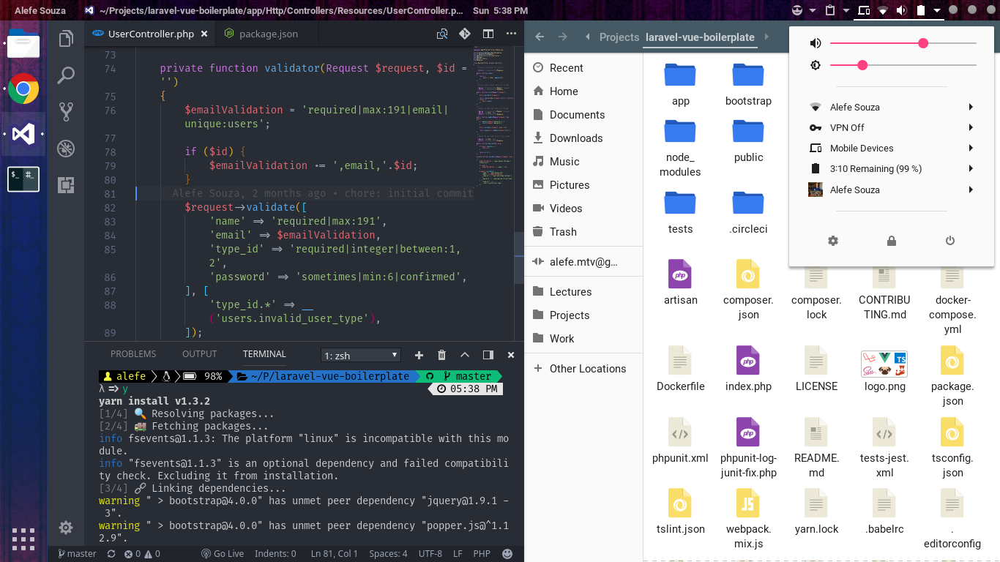

# Arch Linux configuration

Packages I like to install after an Arch Linux installation.

## User interface

### GDM and GNOME
    pacman -S gdm gnome

### [archlinux-wallpaper](https://www.archlinux.org/packages/community/any/archlinux-wallpaper/)
    pacman -S archlinux-wallpaper

### [materia-theme](https://github.com/nana-4/materia-theme) for GNOME
    yaourt -S materia-theme

### [Flat Remix](https://github.com/daniruiz/Flat-Remix) icons
    yaourt -S flat-remix-git

### [Capitaine cursors](https://github.com/keeferrourke/capitaine-cursors)
    yaourt -S capitaine-cursors

### Fonts

#### [Noto Fonts](https://github.com/googlei18n/noto-fonts) for the web, international characters and emoji
    pacman -S noto-fonts noto-fonts-cjk noto-fonts-emoji

#### [Roboto](https://github.com/google/roboto) for the materia-theme
    pacman -S ttf-roboto

I also like to use FiraMono For Nerd Font as my monospace font and FiraCode Nerd Font as my programming font, I don't use always the second because some softwares doesn't support font ligatures. You can download those fonts .zip file [on this website](https://nerdfonts.com/) and extract on your ~/.fonts folder, there's also an [AUR package](https://aur.archlinux.org/packages/nerd-fonts-complete) but it's have a big download size because it downloads every Nerd Font.

## Favorite GNOME Shell extensions

[Activities Configurator](https://extensions.gnome.org/extension/358/activities-configurator/) - I like to put "Alefe Souza" instead of "Activities" on the top left corner.

[Clipboard Indicator](https://extensions.gnome.org/extension/779/clipboard-indicator/) - To have the last 15 clipboards on the top bar.

[Dash to Dock](https://extensions.gnome.org/extension/307/dash-to-dock/) - I like it 50% blue and fixed/extended on the left.

[Drop Down Terminal](https://extensions.gnome.org/extension/442/drop-down-terminal/)

[Emoji Selector](https://extensions.gnome.org/extension/1162/emoji-selector/) - It's very good with Noto Emoji font.

[GSConnect](https://github.com/andyholmes/gnome-shell-extension-gsconnect) - To have the mobile device notifications on the computer.

[Panel OSD](https://extensions.gnome.org/extension/708/panel-osd/) - I like the notifications on the top right corner.

[Refresh Wifi Connections](https://extensions.gnome.org/extension/905/refresh-wifi-connections/)

[Status Area Horizontal Spacing](https://extensions.gnome.org/extension/355/status-area-horizontal-spacing/) - I like to put the Horizontal Padding to 2.

[Status Title Bar](https://extensions.gnome.org/extension/1147/status-title-bar/) - I don't like to have just the fixed application name on the GNOME top bar.

[User Themes](https://extensions.gnome.org/extension/19/user-themes/) - Materia-light-compact as shell theme.

## Terminal

### zsh

    pacman -S zsh

### [oh-my-zsh](https://github.com/robbyrussell/oh-my-zsh)

    yaourt -S oh-my-zsh-git

### [powerlevel9k](https://github.com/bhilburn/powerlevel9k) theme

    git clone https://github.com/bhilburn/powerlevel9k.git $ZSH_CUSTOM/themes/powerlevel9k

## Favorite programs

### [VS Code](https://github.com/Microsoft/vscode) because it's the best text editor

    yaourt -S visual-studio-code-bin

### Google Chrome because...

    yaourt -S google-chrome

### [Tilix](https://github.com/gnunn1/tilix) because it's a great terminal emulator

    yaourt -S tilix

### [Docker](https://github.com/docker/docker-ce) for any programming stuff

    yaourt -S docker docker-compose

## Utilities

### filemanager-actions to add an "Open with Code" options on the nautilus context menu

    pacman -S filemanager-actions
